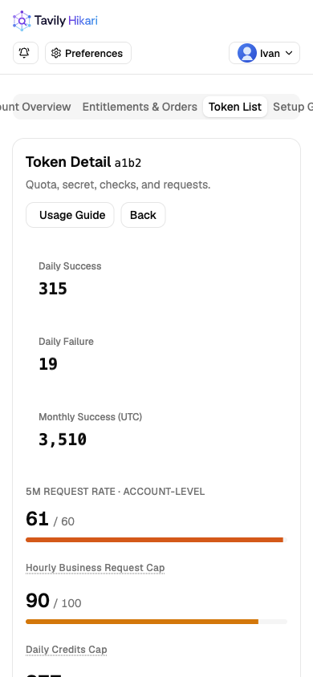
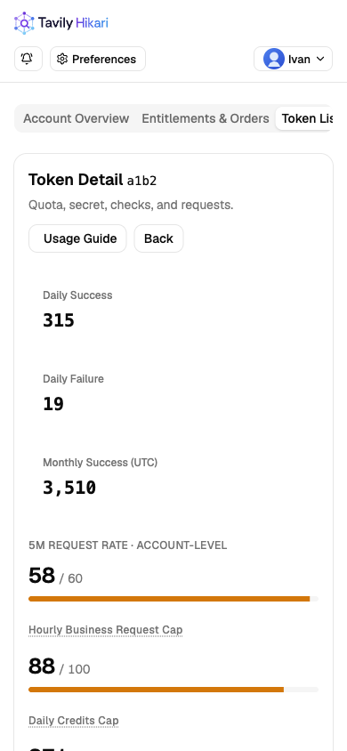
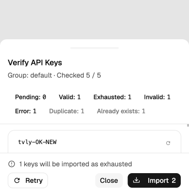

# UI 检查记录 · 2026-10-09

使用 Ego Lite 检查本地 Storybook 的全部 441 个页面、组件与状态样例，并检查演示应用主要路由。
验证使用模拟数据，未访问生产 Tavily，也未执行真实支付、外部登录或硬件 Passkey 操作。

## 覆盖与结果

- 桌面：1440 × 900，441 个样例逐项渲染、截图与页面溢出检查。
- 移动：390 × 844，441 个样例逐项检查；修复后在减少动态效果模式下复验。
- 矮屏：390 × 400，额外检查 9 个长内容、错误与校验弹窗。
- 中英文、明暗主题、加载、空数据、失败、长内容、抽屉、菜单等状态由对应样例覆盖。
- 修复后的覆盖清单没有渲染失败、页面级横向溢出或已打开浮层缺少可访问名称。
- 额外验证了确认弹窗的 Esc 关闭、Tab 焦点限制与焦点返回，以及公告抽屉的初始焦点和关闭后焦点。

完整样例清单和两种视口的检查结果见 [coverage.json](coverage.json)。表格、时间线和导航自身的
可滚动区域不算页面级溢出；抽屉动画过渡中的不足 1px 偏移不算最终位置异常。

## 修复

| 问题 | 修复 |
| --- | --- |
| 英文用户导航在手机宽度下被挤出页面 | 导航限制宽度、左对齐并支持内部横向滚动，标签保持完整 |
| 长内容弹窗和 HA 配置在矮屏下可能越界 | 通用弹窗与 HA 配置限制动态视口高度并提供内容滚动 |
| 弹窗标题可能与关闭按钮重叠 | 有关闭按钮时给标题区预留空间 |
| 普通按钮打开的弹窗关闭后焦点落到 body | 共用焦点恢复逻辑，保留调用方显式 autofocus 行为 |
| 抽屉打开后没有初始焦点 | 默认启用 Vaul autofocus，可由调用方覆盖 |
| API Key 校验弹窗未使用 Radix 可访问标题 | 按视口使用 DialogTitle 或 DrawerTitle |
| 校验抽屉长内容可能挤出底部操作 | 头尾不收缩，校验结果单独滚动 |
| 注册 IP 提示依赖已移除的定位样式 | 改用 shadcn Tooltip 的 portal 与定位能力 |
| 搜索及令牌备注缺少明确可访问名称 | 补充本地化 aria-label |
| 长管理员名称挤出工具栏 | 工具栏可换行并限制宽度 |
| 成功、警告状态文字在浅色主题下对比不足 | 加深对应语义色，保留暗色主题独立颜色 |
| 动画未全面响应减少动态效果设置 | 统一缩短动画、过渡并禁用平滑滚动 |
| 部分 Storybook 抽屉、布局样例仍使用失效旧样式 | 补充标题、滚动区，使用 Card/Table 并修复固定宽度 |

导航修复前后：

校验抽屉在矮屏中的操作区：

## 核对依据

- [Apple HIG Layout](https://developer.apple.com/design/human-interface-guidelines/layout)：适应窗口与文字长度、对齐、内容空间。
- [Apple HIG Accessibility](https://developer.apple.com/design/human-interface-guidelines/accessibility)：可访问名称、键盘操作与文字对比度。
- [Apple HIG Motion](https://developer.apple.com/design/human-interface-guidelines/motion)：尊重减少动态效果设置。
- [Apple HIG Sheets](https://developer.apple.com/design/human-interface-guidelines/sheets)：保留上下文、明确关闭方式与可操作内容。
- [shadcn Dialog](https://ui.shadcn.com/docs/components/radix/dialog)、
  [Drawer](https://ui.shadcn.com/docs/components/radix/drawer)、
  [Tooltip](https://ui.shadcn.com/docs/components/radix/tooltip)：组合语义、标题、portal 与焦点行为。

这是 Web SPA，HIG 用于通用布局和交互原则；检查未把 SF Symbols、原生 Apple 字体或原生材质
当成 Web 组件必须遵循的实现要求。

## 验证边界

样例覆盖与演示路由检查不能证明所有生产数据组合、所有浏览器、所有缩放比例和所有第三方流程
都已验证。颜色检查针对共享状态文字，未进行整站 WCAG 认证。业务写入、真实支付和外部鉴权
仍需对应集成环境的验收。
